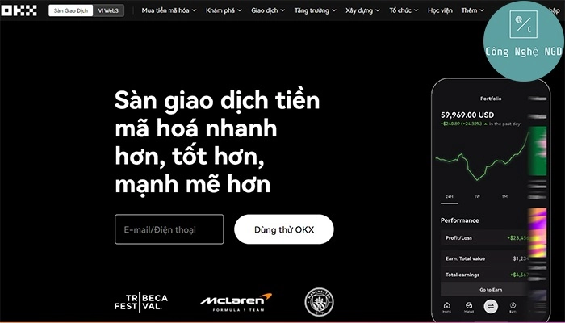
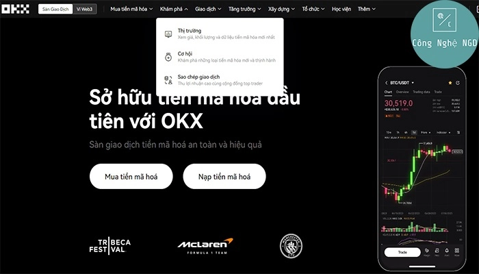
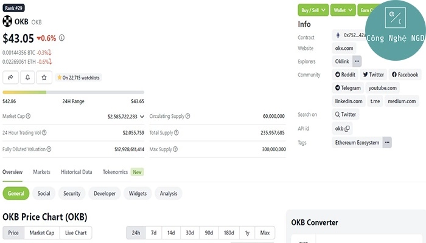

# What is OKX Exchange? An In-Depth Look at This Leading Crypto Platform

So you're curious about OKX? Smart move. In a world where digital currencies are quietly reshaping how we think about money, finding the right trading platform isn't just important—it's essential. OKX isn't your typical crypto exchange. It's where advanced blockchain technology meets practical financial tools, giving you everything you need to trade smarter, not harder. Whether you're hunting for NFTs, exploring DeFi, or just looking for a reliable spot to grow your crypto portfolio, OKX has been making waves for good reason.

---

## What Exactly is OKX Exchange?

Listen, OKX isn't trying to reinvent the wheel—they're just making it spin a whole lot smoother. At its core, OKX is an advanced cryptocurrency exchange platform that leverages blockchain technology to offer innovative financial services. Think of it as your one-stop shop for everything crypto.

The platform was born from a simple idea: what if trading digital assets could actually be... intuitive? Revolutionary concept, right? OKX takes the complicated world of blockchain and turns it into something you can actually use without needing a computer science degree.

Here's the thing—they're not just another exchange collecting trading fees. OKX is built on the belief that cryptocurrency will fundamentally reshape our concepts of money, financial systems, the internet, and ultimately society itself. Big words, sure, but they're backing it up with real tools.

## What Products Does OKX Actually Offer?

Okay, so what can you actually *do* on OKX? Glad you asked. The platform isn't just sitting around—it's packed with features that'll make your crypto journey a lot more interesting.

**NFT Trading Made Simple**
You can create, buy, and sell NFTs directly on their dedicated NFT marketplace. No jumping through hoops or dealing with sketchy third-party sites.

**Comprehensive Trading Options**
Trade hundreds of tokens and trading pairs across spot markets, margin trading, and derivatives. Whether you're a cautious investor or someone who likes a bit more action, there's something here for you.

**DeFi Portfolio Management**
Connect your Web3 wallet and suddenly all your decentralized assets are in one place. It's like Marie Kondo for your crypto—everything organized and sparking joy.

**Explore Decentralized Applications**
Dive into the world's leading decentralized apps, including DeFi protocols and blockchain-based games. The future of the internet is decentralized, and OKX gives you a front-row seat.

**Web3 Wallet Integration**
Connect to DeFi through OKX's Web3 wallet via their app or browser extension. It's your passport to the decentralized world.

**Earn Passive Income**
Here's where it gets interesting. You can actually make your crypto work for you through:
- Mining pools
- Long-term lending with crypto collateral
- Various earning strategies in the OKX Earn section

👉 [Want to explore all these features yourself? Join thousands of smart traders already using OKX](https://www.okx.com/join/62834398)

## The OKX Token (OKB): What You Need to Know

Every major exchange has its own token, and OKX is no exception. The **OKX Token (OKB)** is the platform's native cryptocurrency, officially launched on March 23, 2018, by the OK Blockchain Foundation.

Originally built on Ethereum's ERC-20 standard, OKB has evolved and now runs on its own blockchain—OKChain (OKC). That's right, they graduated from using someone else's blockchain to having their own. Growth, baby.

**Key Details About OKB:**
- **Ticker:** OKB
- **OKChain Contract:** 0xdf54b6c6195ea4d948d03bfd818d365cf175cfc2
- **Ethereum Contract:** 0x75231f58b43240c9718dd58b4967c5114342a86c
- **Decimals:** 18
- **Token Standard:** ERC-20
- **Blockchain:** Ethereum/OKChain
- **Token Type:** Exchange token
- **Market Cap:** Over $2.585 billion USD
- **Total Supply:** 300,000,000 OKB
- **Circulating Supply:** 60,000,000 OKB

The math here is interesting—only 20% of the total supply is currently circulating. That's strategic scarcity working in favor of long-term holders.

## Is OKX Actually Trustworthy?

Look, in crypto, this is THE question everyone should be asking. Let's talk about OKX's credibility without the marketing fluff.

**Corporate Backing and Partnerships**
OKX is a subsidiary of OKcoin Group, a major player in the cryptocurrency world with a solid reputation. But they're not just riding on their parent company's coattails:

- They're the international partner of Manchester City Football Club. Yes, *that* Manchester City.
- They're the main sponsor of McLaren Racing, one of the world's premier racing teams.

These aren't small endorsements. Major global brands don't partner with sketchy exchanges.

**Regulatory Compliance**
Here's the big one: OKX secured a virtual asset license from Dubai's Virtual Asset Regulatory Authority (VARA). Getting regulatory approval isn't easy—it means they passed serious scrutiny about their operations, security measures, and business practices.

**Asset Security Measures**
The platform operates a comprehensive asset protection system using both hot and cold wallets:

- **95% of customer cryptocurrency** is stored in cold wallets, completely offline and protected from hacker attacks
- **5% remains in hot wallets** to facilitate smooth trading operations

This is actually the industry standard for top-tier exchanges, and it's good to see OKX following best practices.

**Market Position**
According to Coingecko, OKX ranks in the **top 4 cryptocurrency exchanges globally** by trading volume. You don't get there by accident—it's earned through high security standards and modern security technology.

The platform employs state-of-the-art security systems including multi-layer encryption, two-factor authentication, and constant monitoring for suspicious activity.

👉 [Ready to experience a secure, feature-rich crypto exchange? Start your journey with OKX today](https://www.okx.com/join/62834398)

---

## Final Thoughts: Why OKX Stands Out

So, what's the verdict? OKX isn't perfect—no exchange is—but it's consistently proving itself as a reliable, innovative platform in the cryptocurrency space. With comprehensive trading options, strong security measures, regulatory compliance, and partnerships with world-class brands, OKX has built itself into one of the industry's most trustworthy exchanges.

Whether you're just starting your crypto journey or you're a seasoned trader looking for a more robust platform, OKX offers the tools, security, and ecosystem you need. The combination of advanced features, user-friendly interface, and serious security infrastructure makes it a compelling choice for anyone serious about cryptocurrency trading.

And remember, with invite code **62834398**, you're not just joining an exchange—you're joining a platform that's actively shaping the future of digital finance. [Start trading smarter on OKX today](https://www.okx.com/join/62834398).
